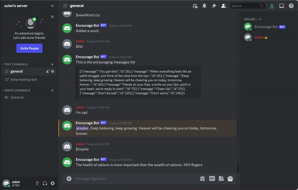

# Discord Encourage Bot - MySQL 

This is a Discord Bot that fetches motivational quotes from the ZenQuotes API as responses to 'dispirited or sad' messages. The sole purpose of the bot is to motivate and cheer up the message sender ! This is a NodeJS project using Discord.js module to allow interaction with the Discord API, Express, Sequelize with MySQL database. 

## Features
After setting up the bot application and creating the Discord server, create a `.env` file that holds the bot token and later on database host, database name, username, password.
### Listen for events
First of all, the bot is listening to a **ready** event. The ready event is fired once the bot is connected :

~~~
client.on("ready", () => {
  console.log(`Bot logged in as ${client.user.tag}!`);
  connectDB();
});
~~~

### Create and handle user commands
Besides the ready event, the Discord client allows us to listen for a message event. This means the bot can read any message that is sent to a channel. 

In this project, the commands for the bot are `$inspire`, `$list`, `$newMessage`, `$del`, `$newWord`, `$responding`.

~~~
client.on("message", async (msg) => {
    //if the author of the message is a bot, and if so, stops processing the command
    if (msg.author.bot) return;
    ///...
~~~

If the command is `$inspire` the bot will make an API call to ZenQuotes retrieve a random motivation quote and send it back to the channel. 

~~~
    if (msg.content === "$inspire") {
    const quote = await getQuote();
    return msg.channel.send(quote);
  }
~~~

If the command is `$list`, the bot will fetch all the encouraging messages and their ids that are stored in the database. Note that these messages are mannually created by User and not from an API.

~~~
  if (msg.content.startsWith(`${PREFIX}list`)) {
    const allmessages = await getAllMessages();
    const msgEmbed = new Discord.MessageEmbed().setDescription(
      JSON.stringify(allmessages)
    );
    return msg.channel.send("This is the encouraging messages list", msgEmbed);
  }
~~~

If the command starts with `$newMessage` followed by a new encouraging message entered by User, the bot will insert it into the database. If the message is empty the bot will ask User to add a new message. 

~~~
  const newCommand = `${PREFIX}newMessage`;
  if (msg.content.startsWith(newCommand)) {
    messageToSend = msg.content.slice(newCommand.length + 1);
    if (messageToSend.trim().length === 0) {
      return msg.channel.send("Please add a message.");
    } else {
      addMessage(messageToSend);
      return msg.channel.send("Added a message.");
    }
  }
~~~

Some other commands including 
- `$del`: delete an encouraging message using its ID from database.
- `$newWord`: add a new sad word to the `sadwords` table.
- `$responding`: turn on/off the responding functionality of the bot. Bot will go silent if the `responding` value is false.

### Deploy MySQL database on Heroku
 - After deploying the Node.js app to Heroku, I used `ClearDB` to configure MySQL Database connection for Node.js on Heroku app. 
 - Take the parameters from the `CLEARDB_DATABASE_URL` such as host, username, password, database name to update the configuration. 
 - Create MySQL tables using specifed Schema or Model. `connectDB()` is called and tables are created when the bot is logged in or when the **ready** event is triggered.
    ~~~
    const Message = require("./models/Message");
    ///...
    exports.connectDB = () => {
      db.authenticate()
        .then(() => {
            Message.init(db);
            ///...
            Message.sync();
            ///...
        })
        .catch((err) => console.log(err));
    };
    ~~~
- Since Heroku uses the `$PORT` environment variable, and it is dynamic hence I need to configure the app
    ~~~
    const PORT = process.env.PORT || 5000;
    app.listen(PORT, () => console.log(`server is running on port ${PORT}`));    
    ~~~

### Keep the bot alive
Because the app "powers down" after 30 mins of inactivity, I used [Kaffeine](http://kaffeine.herokuapp.com/) to ping it so the bot can start back up.

## Technologies 
- NodeJS
- Discord.js
- ZenQuotes API 
- MySQL 
- Heroku Deployment for both MySQL database using ClearDB and the application 

## NPM Installation
- Install the necessary dependencies and devDependencies
    ~~~
    npm install concurrently cors dotenv node-fetch
    ~~~
- To use MySQL in a Node.js application, install the mysql package and Discord node.js module that allows interaction with the Discord API 
    ~~~
    npm install mysql discord.js
    ~~~
- I used Express to support routing, middleware, view system, and Sequelize, which is a promise-based Node.js ORM that supports the dialects for Postgres, MySQL, SQL Server 
    ~~~
    npm install express sequelize
    ~~~